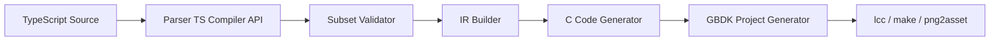

# TypeScript SDK para GBDK-2020 - Blueprint v0.1

## 1) Objetivo
Construir um SDK em TypeScript que transpila codigo TS para C compativel com GBDK-2020, gera projeto compilavel e executa build de ROM.

Meta do MVP:
- Entrada: arquivos `.ts` com um subconjunto definido da linguagem.
- Saida: arquivos `.c/.h` + `Makefile` + ROM `.gb` gerada com `lcc`.

## 2) Nao-objetivos do MVP
- Nao suportar TypeScript completo.
- Nao suportar classes, heranca, async/await, objetos dinamicos, closures.
- Nao suportar autobanking avancado no primeiro ciclo.
- Nao suportar todos os consoles no inicio (foco inicial em `gb`, opcional `gbc`).

## 3) Contrato da linguagem (MVP)

### 3.1 Recursos permitidos
- Tipos primitivos: `u8`, `i8`, `u16`, `i16`, `bool`.
- `const` e `let` com escopo de bloco.
- Funcoes top-level com parametros e retorno simples.
- Controle de fluxo: `if/else`, `while`, `for` simples.
- Arrays estaticos com tamanho fixo.
- Chamadas de API do SDK (`sdk.*`) mapeadas para GBDK.

### 3.2 Recursos proibidos no MVP
- `class`, `extends`, `new` customizado.
- Objetos com shape dinamico.
- Funcoes anonimas/closures capturando contexto.
- `Promise`, `async/await`.
- Recursao profunda (apenas caso explicitamente habilitado depois).
- Tipos genericos complexos.

### 3.3 Regras de erro
- Qualquer recurso fora do subconjunto gera erro de compilacao com:
  - codigo do erro (`TSGBDKxxx`)
  - arquivo e linha
  - sugestao de migracao

Exemplo:
`TSGBDK014: class declarations are not supported in MVP. Use top-level functions + struct-like data.`

## 4) Arquitetura tecnica



### 4.1 Modulos
1. `packages/compiler`
- Parser usando TypeScript Compiler API.
- Validador de subconjunto.
- IR normalizada.
- Codegen para C/H.

2. `packages/runtime-c`
- Wrappers C para APIs de alto nivel.
- Header unico `sdk_runtime.h`.
- Implementacoes pequenas para loop, input, sprite e tiles basicos.

3. `packages/cli`
- Comandos `init`, `transpile`, `build`, `clean`.
- Resolucao de caminho do GBDK (`GBDK_HOME` ou config local).

4. `examples/hello-gb`
- Exemplo minimo compilavel.
- Serve como teste de regressao.

## 5) Estrutura de pastas proposta

```text
ts-gbdk-sdk/
  package.json
  pnpm-workspace.yaml
  tsconfig.base.json
  packages/
    compiler/
      src/
        parser/
        validator/
        ir/
        codegen/
      test/
    runtime-c/
      include/
      src/
    cli/
      src/
  examples/
    hello-gb/
      src/
        game.ts
      assets/
      gbdk-out/
  test/
    golden/
    integration/
  docs/
    language-spec.md
    errors.md
```

## 6) Especificacao de mapeamento TS -> C

### 6.1 Tipos
- `u8` -> `uint8_t`
- `i8` -> `int8_t`
- `u16` -> `uint16_t`
- `i16` -> `int16_t`
- `bool` -> `uint8_t`

### 6.2 Convenios de codigo gerado
- Sempre incluir headers necessarios:
  - `<gb/gb.h>`
  - `<stdint.h>`
  - runtime local do SDK
- Funcoes TS viram funcoes C com nome mangled estavel.
- Variaveis globais TS permitidas viram globais C com prefixo de modulo.

### 6.3 Game loop padrao
- O entrypoint TS gera `void main(void)`.
- Loop padrao inclui `vsync()` ao fim de cada frame.

## 7) Integracao com GBDK e build

### 7.1 Config base
- Alvo inicial: `gb`.
- Makefile inspirado no template minimo do GBDK.
- Build usa `$(GBDK_HOME)/bin/lcc`.

### 7.2 Flags iniciais
- `-m` para port/plataforma quando necessario.
- Sem flags avancadas de banking no MVP.
- Debug opcional via `GBDK_DEBUG`.

### 7.3 Comandos CLI
- `sdk init`
  - cria estrutura de projeto TS + config + template.
- `sdk transpile`
  - gera C/H em `gbdk-out/src`.
- `sdk build --target gb`
  - executa transpile + make/lcc.

## 8) Especificacao do primeiro exemplo (hello-gb)

### 8.1 Objetivo funcional
- Inicializar loop principal.
- Ler input do joypad.
- Mover sprite no eixo X.
- Sincronizar com `vsync()`.

### 8.2 Arquivos esperados
- `examples/hello-gb/src/game.ts`
- `examples/hello-gb/gbdk-out/src/main.c`
- `examples/hello-gb/gbdk-out/Makefile`
- `examples/hello-gb/gbdk-out/build/gb/hello-gb.gb`

### 8.3 Criterio de sucesso
- Build gera ROM sem erro.
- ROM roda em emulador e sprite responde a input.

## 9) Checklist de aceitacao do MVP

### 9.1 Linguagem
- [ ] Parser aceita todos os exemplos do subconjunto definido.
- [ ] Recursos proibidos falham com erro claro e codigo `TSGBDKxxx`.

### 9.2 Geracao de codigo
- [ ] C gerado compila com GBDK sem edicao manual.
- [ ] Names de simbolos sao deterministas entre builds.

### 9.3 Build
- [ ] `sdk build --target gb` gera `.gb` em ambiente limpo.
- [ ] Build funciona em Windows (cmd/powershell) e Linux (bash).

### 9.4 Qualidade
- [ ] Testes golden para codegen (minimo 20 casos).
- [ ] Testes de integracao para build real (minimo 3 casos).
- [ ] Um exemplo publico completo e documentado.

## 10) Plano de implementacao (sequencia curta)

1. Semana 1
- Definir AST suportada e especificacao formal (`language-spec.md`).
- Definir erros padrao (`errors.md`).

2. Semana 2-3
- Implementar parser + validador + IR minima.
- Implementar codegen para funcoes, variaveis e loop.

3. Semana 4
- Implementar CLI (`init`, `transpile`, `build`).
- Integrar Makefile template + chamada de `lcc`.

4. Semana 5
- Implementar exemplo `hello-gb`.
- Criar testes golden e integracao.

## 11) Riscos e mitigacoes

1. Escopo crescer cedo demais
- Mitigacao: gate por subconjunto estrito e erros explicitos.

2. Incompatibilidades com C/SDCC
- Mitigacao: testes de integracao com build real em cada PR.

3. Complexidade de banking
- Mitigacao: adiar para fase 2, com design de anotacoes controlado.

4. Dependencia de ambiente local
- Mitigacao: validar `GBDK_HOME` no CLI com mensagens claras.

## 12) Definition of Done (MVP)
Considerar MVP concluido somente quando:
- O usuario cria projeto com `sdk init`.
- Escreve codigo TS no subconjunto definido.
- Roda `sdk build --target gb`.
- Obtem ROM `.gb` funcional sem alterar C manualmente.
